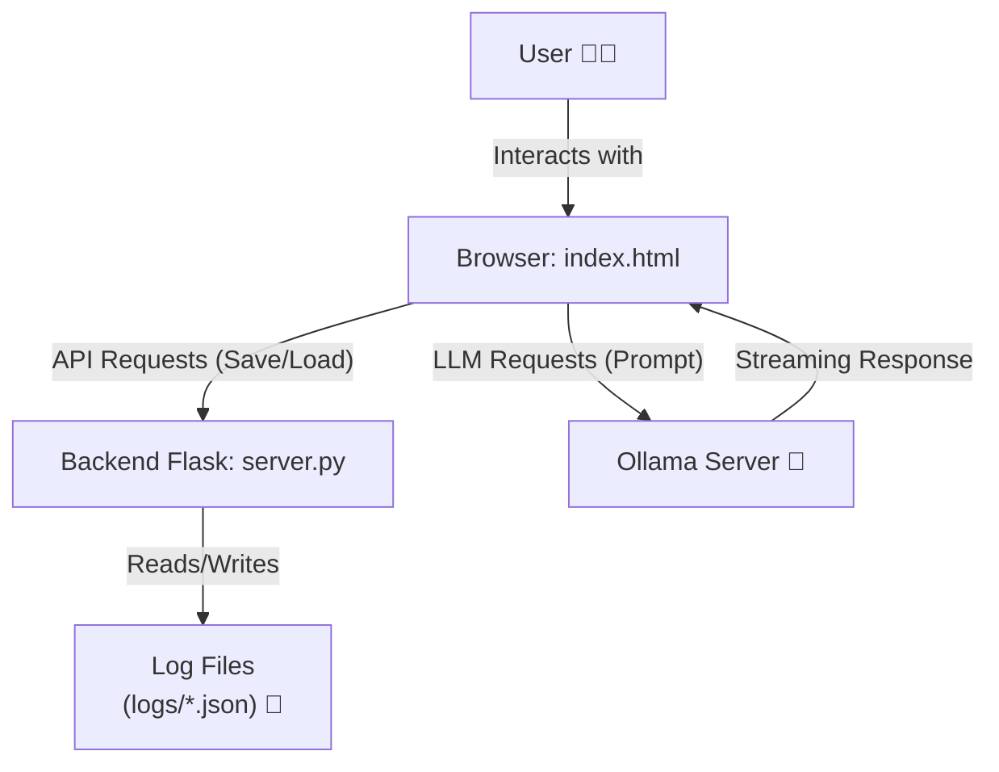

<p align="center">
    
</p>

<h1 align="center">xCavate Web Assistent <br>Private, Self-Hosted Interface for Ollama</h1>


[](https://www.python.org/) [](https://flask.palletsprojects.com/) [](https://developer.mozilla.org/en-US/docs/Web/JavaScript) [](https://opensource.org/licenses/MIT)

xCavate Web Assistent is a sleek, self-contained web interface for interacting with local language models through [Ollama](https://ollama.com/). It provides a private and secure environment for your conversations, running entirely on your local machine. With a lightweight Python/Flask backend and a vanilla JavaScript frontend, xCavate Web Assistent is designed for simplicity, privacy, and hackability.

## 📖 Table of Contents

- [Features](#-features)
- [Architecture](#-architecture)
- [Getting Started](#-getting-started)
  - [Prerequisites](#prerequisites)
  - [Installation & Usage](#installation--usage)
- [Configuration](#-configuration)
- [API Endpoints](#-api-endpoints)
- [Contributing](#-contributing)

---

## ✨ Features

*   **💻 Desktop Application:** xCavate Web Assistent can now be run as a standalone desktop application using Electron, providing a native-like experience.
*   **🔒 Absolute Privacy:** All interactions happen on your local machine. No data is ever sent to third-party servers.
*   **💾 Chat History:** Conversations are automatically saved as JSON files in a `logs` directory, allowing for easy access, backup, and management.
*   **🤖 Model Selection:** Seamlessly switch between different Ollama models using a dropdown menu in the user interface.
*   **✍️ Markdown Rendering:** Enjoy beautifully formatted AI responses, including lists, tables, and code blocks.
*   **💨 Real-Time Streaming:** Experience interactive conversations with the AI's responses streamed in real-time.
*   **📊 Token Counter:** Monitor the context size of your conversations with a progress bar and token counter.
*   **⏱️ Performance Metrics:** Track the generation time for each AI response.
*   **📈 System Monitoring:** Real-time display of CPU and RAM usage within the Electron application.
*   **🚀 Integrated Backend Startup:** The Electron application now automatically manages the startup and shutdown of the Flask backend server.
*   **🛑 Cancel Responses:** Interrupt the AI's response generation at any time.
*   **🛡️ Built-in Security:** Client-side HTML sanitization using `DOMPurify` to prevent XSS attacks.

## 🖼️ Screenshots

<p align="center">
    
</p>

## 🛠️ Architecture

xCavate Web Assistent's architecture is composed of two main components:

1.  **`server.py` (Backend):** A lightweight Flask server that serves the main `index.html` file and provides a REST API for managing chat logs (CRUD operations).
2.  **`index.html` & JavaScript modules (Frontend):** A vanilla JavaScript application that communicates directly with the Ollama server for AI interactions and with the Flask server for chat history management.



## 🚀 Getting Started

### Prerequisites

*   [Python 3](https://www.python.org/downloads/) and `pip`.
*   [Ollama](https://ollama.com/) installed and running.
*   At least one Ollama model downloaded (e.g., `ollama pull gemma3`).

### Installation & Usage

1.  **Clone the repository:**

    ```bash
    git clone https://github.com/your-username/xcavate-web-assistent.git
    cd xcavate-web-assistent
    ```
2.  **Run the start script:**

    The `start.sh` script automates the setup process, including installing dependencies and launching the necessary servers.

    ```bash
    ./start.sh
    ```

    This will:
    *   Install the required Python packages from `requirements.txt`.
    *   Start the Ollama server in the background.
    *   Start the Flask backend server.
    *   Open the xCavate Web Assistent web interface in your default browser.

3.  **Start chatting!**

    You can now interact with your local language models through the xCavate Web Assistent interface.

### Desktop Application (Electron)

xCavate Web Assistent can also be run as a desktop application using Electron, providing a native-like experience.

1.  **Install Node.js dependencies:**

    ```bash
    npm install
    ```

2.  **Start the Electron application:**

    ```bash
    npm start
    ```

    This will launch the xCavate Web Assistent desktop application. Ensure your Ollama server is running in the background.

    **Note:** The Electron application currently expects the Flask backend to be running separately. You can start it using `./start.sh` (which also starts Ollama) or by manually running `python server.py` in a separate terminal.


## ⚙️ Configuration

To customize the default settings, such as the default Ollama model or the Ollama server URL, you can modify the `js/config.js` file:

```javascript
// js/config.js
export const DEFAULT_OLLAMA_MODEL = "gemma3"; // Set your preferred default model
export const OLLAMA_BASE_URL = "http://localhost:11434"; // Modify if your Ollama server runs on a different URL
```

## 🤓 API Endpoints

The Flask backend exposes a simple REST API for managing chat logs:

*   `GET /api/chats`: Retrieves a list of all saved chats.
*   `GET /api/chats/<chat_id>`: Retrieves the content of a specific chat.
*   `POST /api/chats`: Saves or updates a chat.
*   `DELETE /api/chats/<chat_id>`: Deletes a specific chat.

## 🤝 Contributing

Contributions are welcome! If you have any ideas for improvements or new features, feel free to fork the repository, make your changes, and submit a pull request.

Some ideas for contributions include:

*   Implementing a more advanced chat history with folders and search functionality.
*   Adding support for different themes (e.g., light, dark, cyberpunk).
*   Adding the ability to export chats as Markdown or PDF files.

