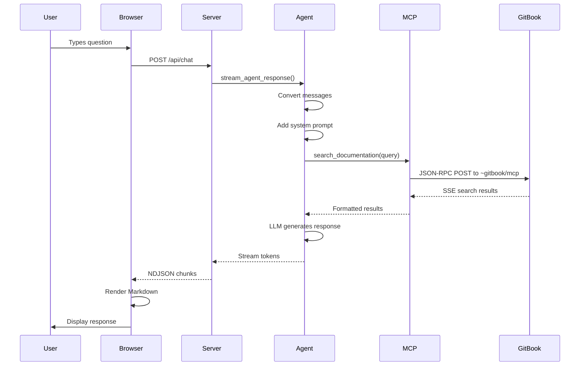

# Architecture Details

## Backend (Python)

### server.py
Flask application providing:

**Static Routes:**
- `GET /` - Serves index.html
- `GET /css/<filename>` - CSS static assets
- `GET /js/<filename>` - JavaScript static assets

**API Endpoints:**
- `POST /api/chat` - Streaming chat endpoint (NDJSON)
- `GET /api/chats` - List all saved chats
- `POST /api/chats` - Save or update a chat
- `GET /api/chats/<id>` - Get a specific chat
- `DELETE /api/chats/<id>` - Delete a chat
- `GET /api/mcp-status` - GitBook MCP connection status
- `POST /api/web-search` - Direct documentation search

**Chat Storage:**
- Logs directory: `logs/`
- Format: `<chat_id>.json`
- Auto-created on first run

### langgraph_agent.py
Core agent logic using LangGraph:

**System Prompt:** Defines AI behavior as RealXmarket support assistant. Instructs to use `search_realxmarket_docs` tool automatically when unsure.

**Tools:**
- `search_realxmarket_docs(query: str) -> str` - Searches RealXmarket documentation via GitBook MCP

**Streaming Flow:**
1. Convert incoming message dicts to LangChain message objects
2. Add system prompt if not present
3. Invoke LLM with tools bound
4. If tool call detected:
   - Execute tool (calls GitBook MCP client)
   - Log to console (for debugging)
   - Add AI message + tool response to context
   - Stream final answer
5. If no tool call: stream response directly

**Key Functions:**
- `create_llm_with_tools(model)` - Returns ChatOpenAI with tool binding
- `ai_node(state, llm)` - LLM reasoning step
- `tool_node(state)` - Tool execution step
- `final_answer_node(state, llm)` - Final response after tool use
- `stream_agent_response(messages, model)` - Main streaming entry point

### gitbook_mcp_client.py
GitBook MCP client for documentation search:

**Features:**
- HTTP-based JSON-RPC client for GitBook MCP server
- Connects to `https://doc-hub.xcavate.io/~gitbook/mcp`
- Real-time documentation search without local indexing
- Two available tools: `searchDocumentation` and `getPage`

**Key Functions:**
- `search_documentation(query)` - Search docs via GitBook MCP
- `get_page(url)` - Fetch full page content
- `list_tools()` - List available MCP tools
- `get_mcp_status()` - Check connection status

**Search Flow:**
1. Send JSON-RPC POST request to GitBook MCP server
2. Parse SSE-formatted response
3. Return formatted search results with titles, links, and content

---

## Frontend (JavaScript)

### Runtime config
Configuration comes from `/api/config`, which is populated from `.env` values:
- `OPENAI_MODEL`
- `MAX_CONTEXT_WINDOW`

### js/api.js
API client module:
- `streamAgentResponse(history, model, onChunk, onDone, signal)` - Streams chat responses
- Includes embedded system prompt (should match backend)
- Handles NDJSON parsing from server
- Markdown rendering via `marked` library
- HTML sanitization via `DOMPurify`

### js/state.js
Client-side state management:
- Active chat ID
- Current chat history
- Current model selection
- Attachments (file uploads)
- Model context windows map

### js/ui.js
DOM manipulation helpers:
- `addMessageToLog(role, content)` - Render message in chat log
- `renderInlineQuickReplies(replies, onSelect)` - Show follow-up suggestions
- `bindQuickStartActions(onSelect)` - Bind quick action buttons
- `updateTokenCounter(count, max)` - Update token usage UI
- `showLanding()`, `showChat()` - View navigation
- `toggleLoading(isLoading)` - Loading state management

### js/app.js
Main application:
- Event handlers for form submit, quick actions
- `handleFormSubmit(event)` - Process user input
- `submitQuickAction(promptText)` - Handle quick action clicks
- `generateQuickReplies(prompt, response)` - Suggest follow-ups
- `streamAgentResponse()` integration
- Error handling and loading states

---

## Message Format

**Request Body:**
```json
{
  "messages": [
    { "role": "system", "content": "..." },
    { "role": "user", "content": "What is KYC?" },
    { "role": "assistant", "content": "..." }
  ],
  "model": "gpt-4o"
}
```

**Response Format (NDJSON):**
```
{"message": {"content": "To"}, "done": false}
{"message": {"content": " complete"}, "done": false}
{"message": {"content": " KYC..."}, "done": false}
{"done": true}
```

**Error Response:**
```
{"error": "Error message here", "done": true}
```

---

## Tool Integration

The `gitbook_mcp_client` module provides:
- `search_documentation(query)` - Search documentation via GitBook MCP
- `get_page(url)` - Fetch full page content
- `get_mcp_status()` - Check if MCP server is available

**Tool Call Logging:**
```
[TOOL CALL] search_realxmarket_docs with query: "How to recover account?"

[TOOL RESPONSE] Title: Getting started\nLink: https://doc-hub.xcavate.io/...\nContent: ...
```

**MCP Connection:**
- On startup, checks connection to `https://doc-hub.xcavate.io/~gitbook/mcp`
- Uses JSON-RPC 2.0 over HTTP POST with SSE responses
- Available tools: `searchDocumentation`, `getPage`

---

## Data Flow Diagram


