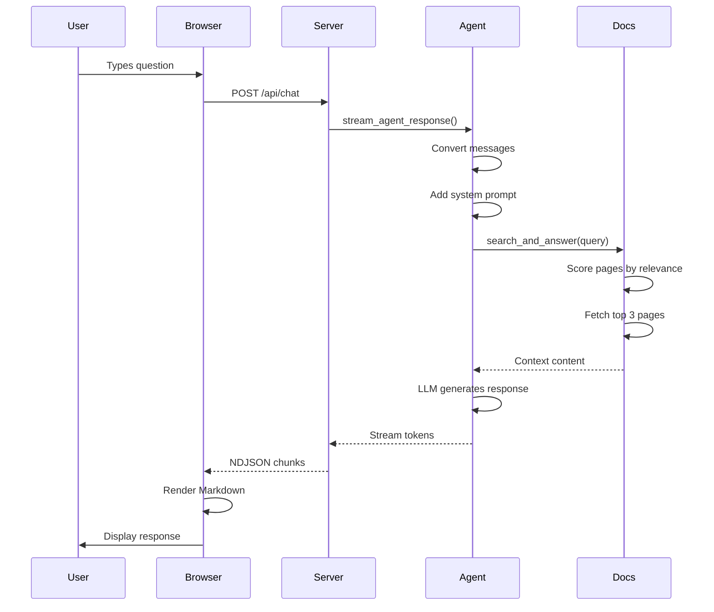

# Architecture Details

## Backend (Python)

### server.py
Flask application providing:

**Static Routes:**
- `GET /` - Serves index.html
- `GET /css/<filename>` - CSS static assets
- `GET /js/<filename>` - JavaScript static assets

**API Endpoints:**
- `POST /api/chat` - Streaming chat endpoint (NDJSON)
- `GET /api/chats` - List all saved chats
- `POST /api/chats` - Save or update a chat
- `GET /api/chats/<id>` - Get a specific chat
- `DELETE /api/chats/<id>` - Delete a chat
- `GET /api/mcp-status` - Documentation search status
- `POST /api/web-search` - Direct documentation search

**Chat Storage:**
- Logs directory: `logs/`
- Format: `<chat_id>.json`
- Auto-created on first run

### langgraph_agent.py
Core agent logic using LangGraph:

**System Prompt:** Defines AI behavior as RealXmarket support assistant. Instructs to use `search_realxmarket_docs` tool automatically when unsure.

**Tools:**
- `search_realxmarket_docs(query: str) -> str` - Searches RealXmarket documentation at doc-hub.xcavate.io

**Streaming Flow:**
1. Convert incoming message dicts to LangChain message objects
2. Add system prompt if not present
3. Invoke LLM with tools bound
4. If tool call detected:
   - Execute tool
   - Log to console (for debugging)
   - Add AI message + tool response to context
   - Stream final answer
5. If no tool call: stream response directly

**Key Functions:**
- `create_llm_with_tools(model)` - Returns ChatOpenAI with tool binding
- `ai_node(state, llm)` - LLM reasoning step
- `tool_node(state)` - Tool execution step
- `final_answer_node(state, llm)` - Final response after tool use
- `stream_agent_response(messages, model)` - Main streaming entry point

### realxmarket_docs.py
Documentation search client:

**Features:**
- Fetches and indexes sitemap from doc-hub.xcavate.io
- Keyword-based search with relevance scoring
- Support query detection (boosts tester guides)
- Content fetching with artifact cleaning

**Key Functions:**
- `initialize_docs()` - Fetch and index sitemap on startup
- `search_docs(query, max_results)` - Search indexed docs by keyword
- `fetch_page_direct(url)` - Fetch page content as markdown
- `search_and_answer(query)` - Main entry point for search+answer
- `clean_doc_content(text)` - Remove artifacts from fetched content
- `get_docs_status()` - Check if docs are available

**Search Algorithm:**
1. Extract keywords from query
2. Score pages based on keyword matching in URL/title
3. Boost pages for support-related queries (tester guides, login, etc.)
4. Return top N results with scores
5. Fetch content from top 3 pages
6. Format results for AI consumption

---

## Frontend (JavaScript)

### js/config.js
Configuration constants:
- `DEFAULT_MODEL = "gpt-4o"`
- `MAX_CONTEXT_WINDOW = 8192`

### js/api.js
API client module:
- `streamAgentResponse(history, model, onChunk, onDone, signal)` - Streams chat responses
- Includes embedded system prompt (should match backend)
- Handles NDJSON parsing from server
- Markdown rendering via `marked` library
- HTML sanitization via `DOMPurify`

### js/state.js
Client-side state management:
- Active chat ID
- Current chat history
- Current model selection
- Attachments (file uploads)
- Model context windows map

### js/ui.js
DOM manipulation helpers:
- `addMessageToLog(role, content)` - Render message in chat log
- `renderInlineQuickReplies(replies, onSelect)` - Show follow-up suggestions
- `bindQuickStartActions(onSelect)` - Bind quick action buttons
- `updateTokenCounter(count, max)` - Update token usage UI
- `showLanding()`, `showChat()` - View navigation
- `toggleLoading(isLoading)` - Loading state management

### js/app.js
Main application:
- Event handlers for form submit, quick actions
- `handleFormSubmit(event)` - Process user input
- `submitQuickAction(promptText)` - Handle quick action clicks
- `generateQuickReplies(prompt, response)` - Suggest follow-ups
- `streamAgentResponse()` integration
- Error handling and loading states

---

## Message Format

**Request Body:**
```json
{
  "messages": [
    { "role": "system", "content": "..." },
    { "role": "user", "content": "What is KYC?" },
    { "role": "assistant", "content": "..." }
  ],
  "model": "gpt-4o"
}
```

**Response Format (NDJSON):**
```
{"message": {"content": "To"}, "done": false}
{"message": {"content": " complete"}, "done": false}
{"message": {"content": " KYC..."}, "done": false}
{"done": true}
```

**Error Response:**
```
{"error": "Error message here", "done": true}
```

---

## Tool Integration

The `realxmarket_docs` package provides:
- `initialize_docs()` - Initialize documentation index from sitemap
- `search_and_answer(query)` - Search and return relevant info
- `get_docs_status()` - Check if docs are available

**Tool Call Logging:**
```
[TOOL CALL] search_realxmarket_docs with query: "How to recover account?"

[TOOL RESPONSE] Found documentation about account recovery...
```

**Indexing Behavior:**
- On startup, fetches sitemap from https://doc-hub.xcavate.io/sitemap-pages.xml
- Indexes only `/applications/xcavate-dapp/*` and `/protocol/*` pages
- Stores URLs, titles, and keywords for each page
- Typically indexes 100+ documentation pages

---

## Data Flow Diagram


